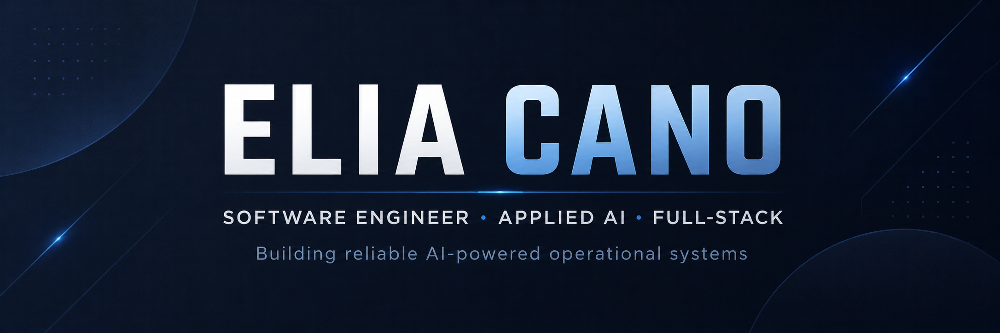

<!--
Optional future banner:
[](https://github.com/ecano08)
-->

<h1 align="center">Hi, I'm Elia Cano 👋</h1>

<h3 align="center">
Software Engineer · Applied AI · Full-Stack Development
</h3>

<p align="center">
I build operational software and AI-powered systems using modern web technologies,
LLMs, APIs, deterministic business logic, and human-in-the-loop workflows.
</p>

<p align="center">
  <a href="https://github.com/ecano08">
    
  </a>
  <a href="https://github.com/ecano08/ai-logistics-copilot">
    
  </a>
</p>

---

## 👨‍💻 About Me

I'm a software developer focused on building practical systems that solve real operational problems.

My background is primarily in full-stack and backend development, and I'm currently expanding that experience into production-oriented AI systems.

I enjoy working on the intersection of:

- 🧠 Applied AI and LLM integration
- ⚙️ Backend systems and business logic
- 🌐 Full-stack web applications
- 🔌 APIs and external integrations
- 🗄️ Data and PostgreSQL
- 🐳 Dockerized environments
- 🔁 CI/CD and automated testing
- 🛡️ AI safety and human approval workflows

My current focus is learning how to build AI systems that are useful in real operations — not just chatbots.

---

## 🚀 Featured Project

### [AI Logistics Copilot](https://github.com/ecano08/ai-logistics-copilot)

An AI-powered logistics operations copilot designed to explore how LLMs can safely interact with operational systems.

The system combines:

```text
React + TypeScript
        ↓
Node.js + TypeScript API
        ↓
PostgreSQL

        +

Python + FastAPI
        ↓
OpenAI / LLM Tool Calling
        ↓
Operational Tools
        ↓
Deterministic Risk Engine
        ↓
Human Approval
```

### Key capabilities

- LLM Tool Calling
- Multi-step AI workflows
- Shipment and customer lookup
- External weather API integration
- Deterministic delay-risk scoring
- Shipment risk prioritization
- Structured operational recommendations
- Human-in-the-loop escalation proposals
- AI safety evaluations
- Structured observability
- Docker Compose environment
- Automated testing
- GitHub Actions CI

### Example workflow

```text
Operator asks about SHP-1010
        ↓
LLM resolves shipment
        ↓
Operational data is retrieved
        ↓
Risk engine evaluates shipment
        ↓
HIGH risk / Score 90
        ↓
AI explains the result
        ↓
Escalation is proposed
        ↓
Human approval required
```

The main design principle is:

> AI can investigate, reason, recommend, and prepare actions — but critical operational decisions remain controlled by deterministic software and humans.

[View AI Logistics Copilot →](https://github.com/ecano08/ai-logistics-copilot)

---

## 🧠 Applied AI

Technologies and patterns I'm currently working with:


- LLM integration
- Tool / function calling
- Structured outputs
- Agent workflows
- Deterministic AI guardrails
- Human-in-the-loop systems
- AI evaluations
- Safety checks
- Observability
- External API integration

---

## 🛠️ Tech Stack

### Frontend


### Backend


### Data


### Infrastructure & Tools


---

## 🏗️ What I Like Building

```text
Business problem
      ↓
Software architecture
      ↓
APIs + data
      ↓
Business rules
      ↓
AI where it adds value
      ↓
Testing + safety
      ↓
Real operational workflow
```

I'm particularly interested in systems where AI has to work with existing software, APIs, databases, users, and real business constraints.

---

## 🔭 Current Focus

I'm currently deepening my experience in:

- Applied AI engineering
- LLM-based operational systems
- Python + FastAPI
- Node.js + TypeScript
- React + TypeScript
- Tool calling
- Agentic workflows
- AI evaluations
- Observability
- Docker
- Cloud architecture
- Forward Deployed Engineering patterns

---

## 📌 Selected Work

### 🤖 AI Logistics Copilot

**Applied AI / Logistics / Operations**

`React` `TypeScript` `Node.js` `Python` `FastAPI` `PostgreSQL` `OpenAI` `Docker`

A portfolio project demonstrating safe integration between LLMs and operational software.

[View repository →](https://github.com/ecano08/ai-logistics-copilot)

---

## 📊 GitHub

<p align="center">
  
</p>

<p align="center">
  
</p>

---

## 💡 Engineering Philosophy

I prefer building AI systems where:

```text
LLM reasoning
+
controlled tools
+
deterministic business logic
+
external APIs
+
tests
+
human approval
+
observability
```

rather than giving an LLM unrestricted control over business operations.

---

## 🤝 Let's Connect

I'm interested in software engineering opportunities involving:

- Applied AI
- AI Engineering
- Forward Deployed Engineering
- Backend Engineering
- Full-Stack Engineering
- AI-enabled operational systems

You can explore my work here on GitHub:

👉 **[github.com/ecano08](https://github.com/ecano08)**

---

<p align="center">
  <b>Building software that connects business logic, real-world operations, and AI.</b>
</p>
